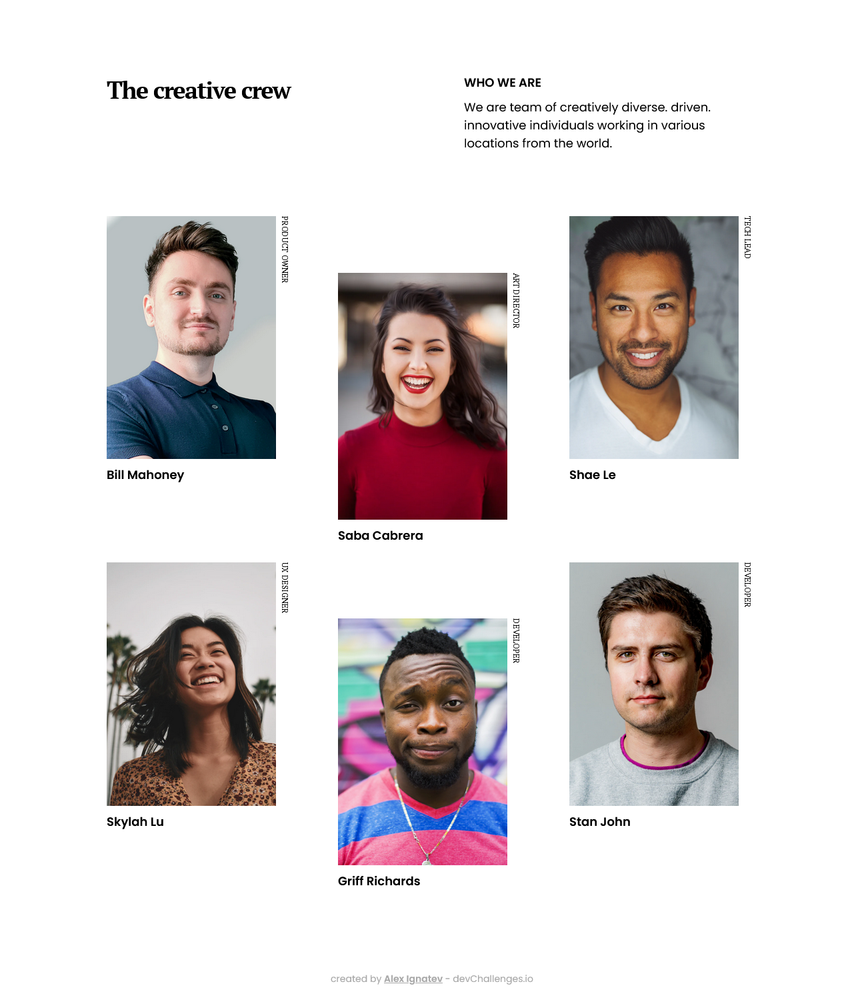

<h1 align="center">My team page</h1>

   Solution for a challenge from  <a href="http://devchallenges.io" target="_blank">Devchallenges.io</a>.

  <h3>
    <a href="https://alexign473.github.io/devchallenges/01-my-team-page/">
      Demo
    </a>
     | 
    <a href="https://devchallenges.io/solutions/LazZubciacIyl21DOD3G">
      Solution
    </a>
     | 
    <a href="https://devchallenges.io/challenges/hhmesazsqgKXrTkYkt0U">
      Challenge
    </a>
  </h3>

<!-- OVERVIEW -->

## Overview

## Features

<!-- List the features of your application or follow the template. Don't share the figma file here :) -->

This application/site was created as a submission to a [DevChallenges](https://devchallenges.io/challenges) challenge. The [challenge](https://devchallenges.io/challenges/hhmesazsqgKXrTkYkt0U) was to build an application to complete the given user stories.
